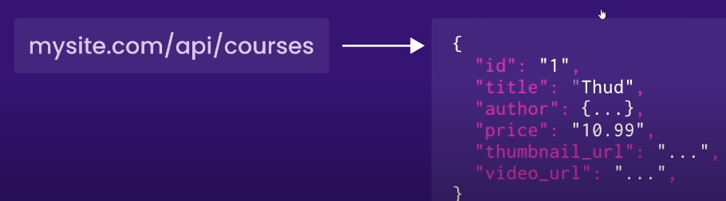
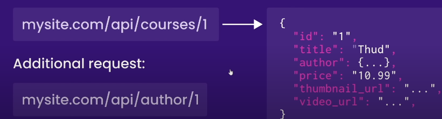
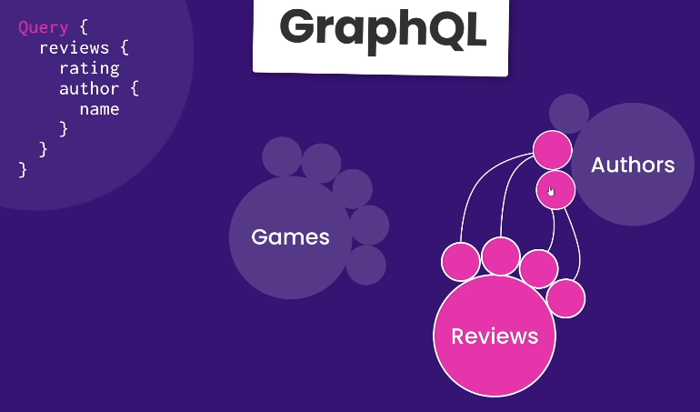
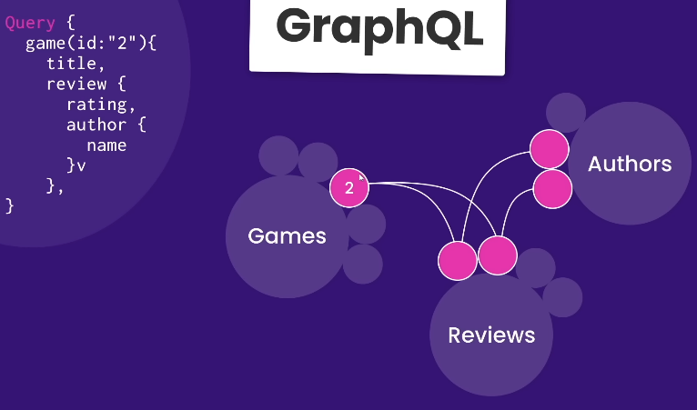
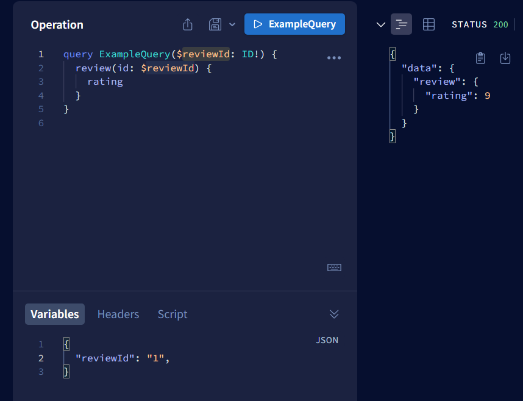
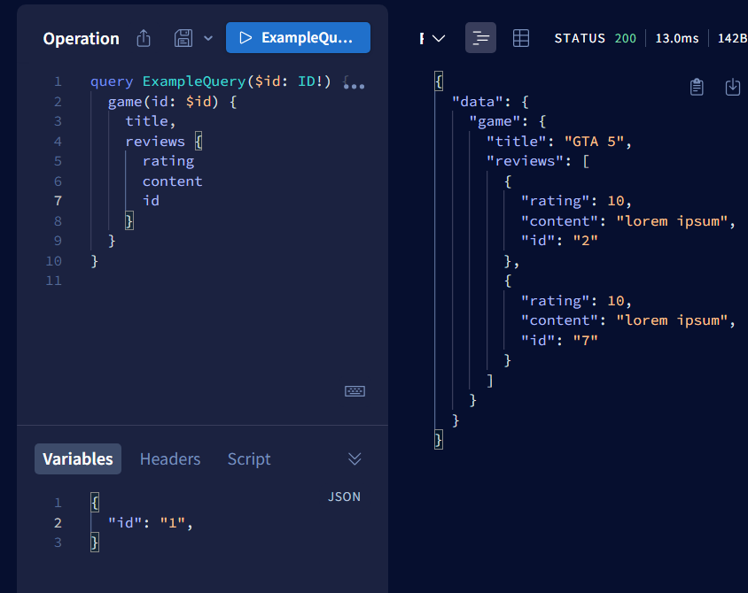
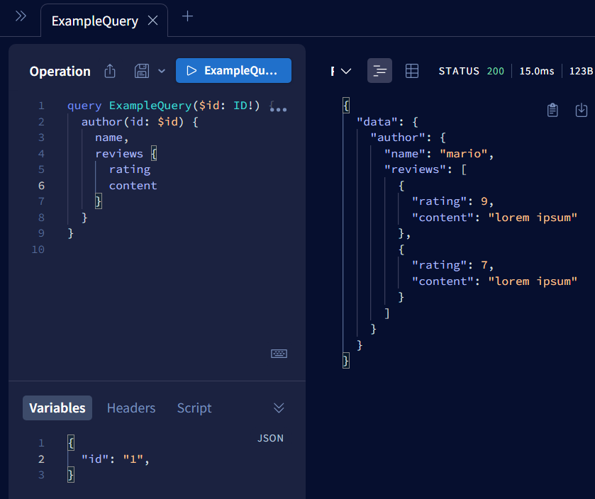
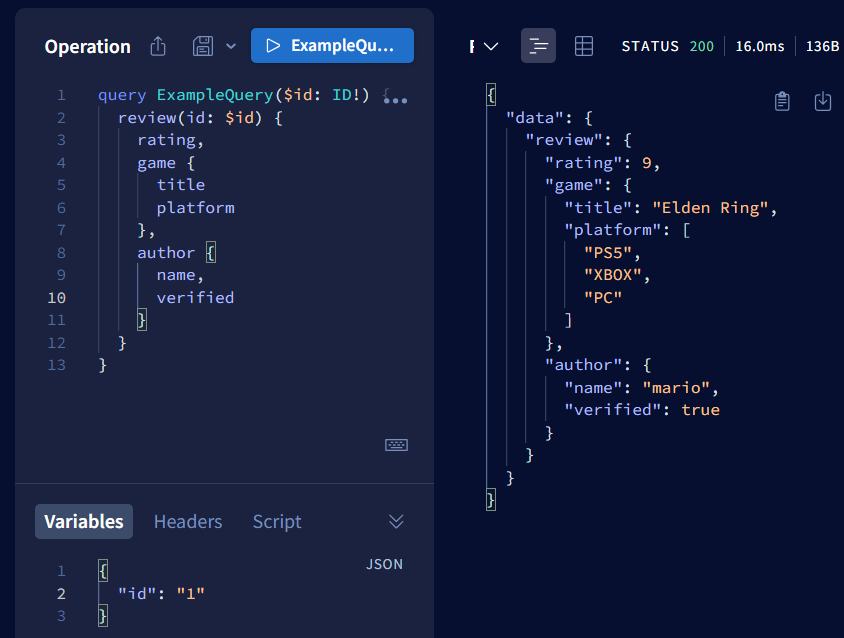
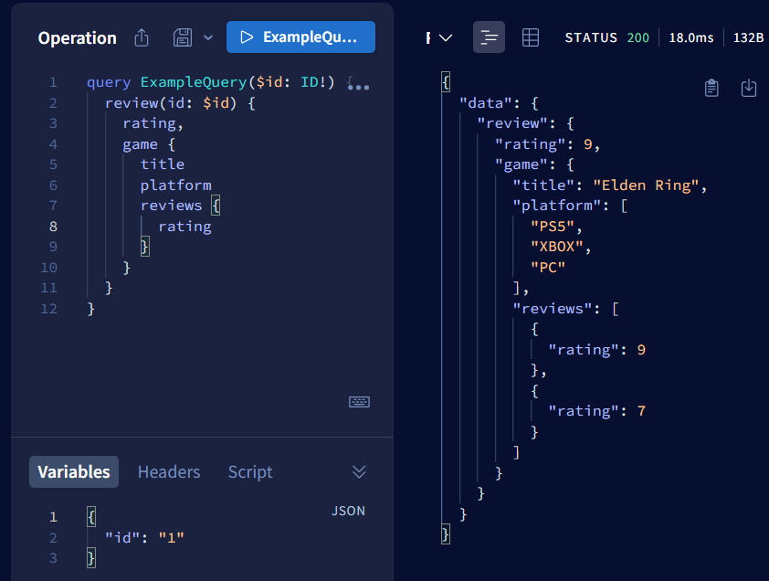

# Intro to GraphQL

- GraphQL is a Query Language
- Alternative to using a REST API
- Uses HTTP requests under the hood, with the Query language sitting on top.

- Traditional REST API <br>
```
GET pokemonsite.com/api/pokemon
POST pokemonsite.com/api/pokemon/123
DEL pokemonsite.com/api/pokemon/123
PUT pokemonsite.com/api/pokemon/123
```
- Drawbacks:
    - Over fetching - Getting back more data than we need.
    
    - Under fetching - Getting back less data than we need.
    

- How GraphQL tackles this?
    - Single endpoint
    `mygraphqlsite.com/graphql`
    ```sql
    Query{
        courses{
            id,
            title,
            thumbnail_url
        }
    }
    ```
    So, server returns the specified data only.

## Why 'adopt' GraphQL ?

- Managing data in modern applications is challenging. Most applications require:

    - Distinct front-end clients for multiple platforms (web, iOS, etc.), each with different data requirements
    - A backend that serves data to clients from multiple sources (Postgres, Redis, etc.)
    - Complex state and cache management for both the frontend and the backend

- By adopting GraphQL and Apollo, you can reduce these challenges considerably. GraphQL's declarative model helps you create a consistent, predictable API you can use across all of your clients. As you add, remove, and migrate backend data stores, that API doesn't change from the client's perspective.

Using REST, the page might need to:

1. GET a list of shelters and their corresponding pet_ids from the /api/shelters endpoint
2. GET each individual pet's details (name, photo URL, etc.) with a separate request to /api/pets/PET_ID

This solution requires multiple dependent network requests, which can result in slower page loads and additional battery consumption on mobile devices. This logic is also difficult to reuse on other pages that display slightly different data.

Using **GraphQL**, the page can obtain all of this data with a single query to a single endpoint. That query looks like this:

```sql
query GetPetsByShelter {
  shelters {
    name
    pets {
      name
      photoURL
    }
  }
}
```

This query describes the shape of the data we want to receive from the GraphQL server. The server takes care of combining and filtering back-end data to return exactly what we ask for. This keeps payload sizes small, especially compared to a REST endpoint that might return hundreds of unnecessary fields.

## Requirements
- Node.js
- Apollo Server (library)

## Query Basics

- Apollo Explorer is a way for us to send test queries to a GraphQL server and see the responses we get back from it.
- Very similar to Postman

- We can launch an Apollo Sandbox - https://www.apollographql.com/docs/graphos/explorer/sandbox/ 
- Sandbox loads a GraphQL server's schema via introspection, instead of fetching published schemas from the Apollo registry.

- Types and fields used in introspection are prefixed with __ (two underscores).
```sql
{
  __schema {
    types {
      name
    }
  }
}
```
## Examples of Queries

- Here, we access two different resources in one query.


- Here is another Graph Query (Nested):


- Moreover, you can do all sorts of `Mutations` or CRUD operations using Graph Queries.

## Making our own GraphQL server on the backend

- GraphQL is like a lyer between the Database and the frontend.

- Benefit of using an Apollo Server is that it automaticaaly spins up an instance of an Apollo Explorer on the localhost, which we can use to test our API's.

- Initiliaze `package.json`
```cmd
npm init -y
```
- Allow us to use ES6 modules:
```cmd
npm pkg set type="module"
```
- Install dependencies:
```cmd
npm install @apollo/server graphql nodemon
```
- Create `index.js` file.

- Download & Install the VSCode Extension for `GraphQL Syntax Highlighting`.

- Make a schema inside `schema.js`. We define here the different types of data.

- Make a database inside `_db.js`.

- Import the schema and DB inside `index.js` and pass the `typeDefs` and `resolver` functions inside ApolloServer instance.

- Run:
```cmd
node index.js
```
 OR

 ```cmd
 npm start
 ```

- Go to `localhost:4000`

- Run Example Query:
```sql
query GameQuery {
  games {
    title,
    platform
  }
}
```

- So, eventhough we explicitly return all the data in our resolver function, Apollo Server is using our resolver function and the data we return to automatically filter out any of the fields the user doens't need.

## Query Variables

- What if we needed to fetch a single author, game or review ? - We need to use `Query variables`

- We need to create an entry-point in the `Query`, then make a resolver function for it, then test it out in the browser.



Similarly, implement the Query `variables` for author and `game`.

## Related Data

- Every `Review` is related to a `Game` and an `Author` in our DB.
- We need to communicate this to our Schema and make the resolver functions.

Reviews Data associated with Game Data


Reviews Data associated with Author Data


Author & Game Data associated with Review Data


All reviews of a Game


# Reference
